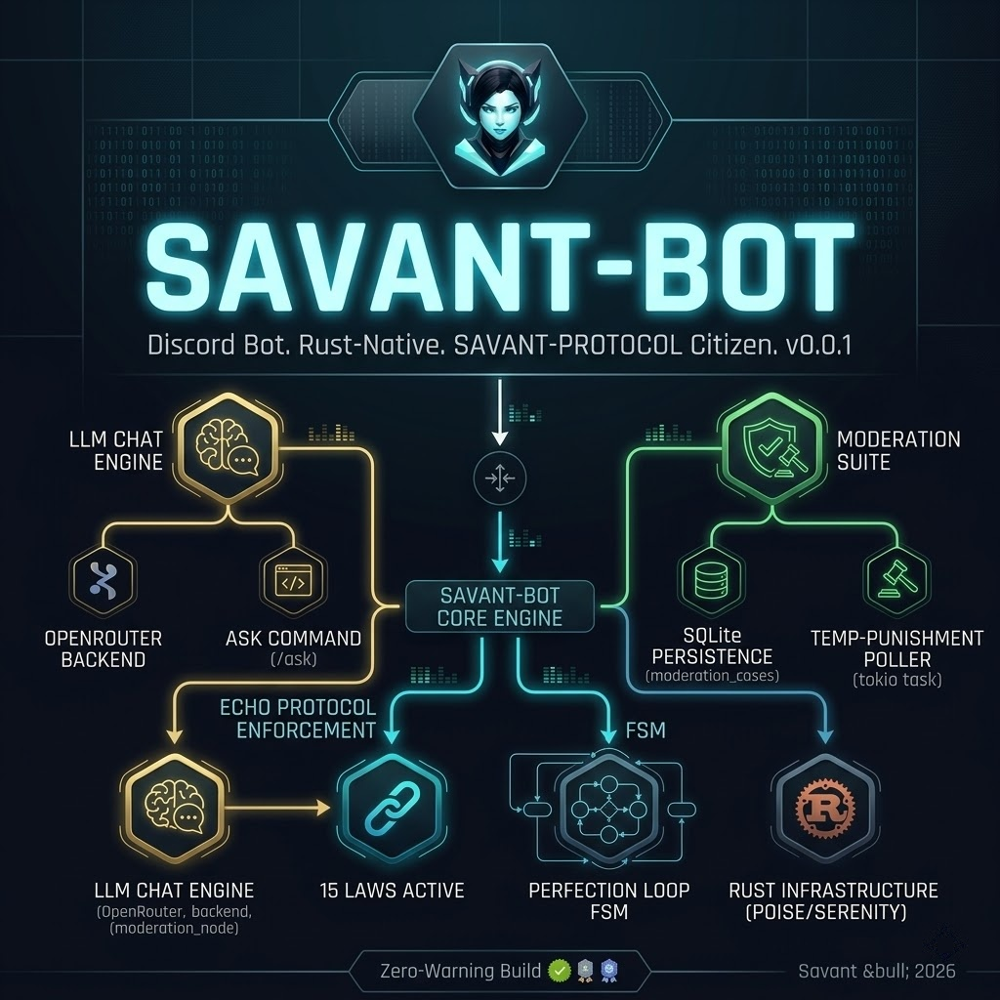

<!-- markdownlint-disable MD033 -->
<div align="center">




# SAVANT-BOT v0.0.2

**Discord Bot. Rust-Native. SAVANT-PROTOCOL Citizen.**

A production-grade Discord bot that ships with the full SAVANT ecosystem's agentic infrastructure. It exposes LLM-backed chat, moderation, and event-driven commands to Discord servers — all built under the SAVANT-PROTOCOL (ECHO) discipline.

**Zero Warning Build:** `cargo clippy --all-targets -- -D warnings` produces zero warnings. Zero `unwrap()`/`expect()` in non-test code. Enterprise-grade error handling throughout.

**OpenRouter-Backed LLM:** Defer-then-edit slash commands with token-bucket rate limiting, exponential backoff on 429, and a sliding-window conversation context. Provider trait + MockProvider for tests; OpenRouter as the v1 production backend (free tier via `openrouter/free`).

**SQLite-Backed Persistence:** Temp-punishment cases (mute, timeout, ban) persisted to SQLite with WAL journaling. A 60-second polling task reverses expired punishments on bot restart — no volatile `tokio::time::sleep` timers.

**ECHO Protocol v0.1.3 Active:** 15 laws, 5-state Perfection Loop FSM, 5 circuit-breaker rules, FID lifecycle (Created → Archived), session summaries, cross-session `LEARNINGS.md`, honest assessment. All wired.

[](https://www.rust-lang.org/)[](https://github.com/serenity-rs/poise)[](https://sqlite.org/)[](https://openrouter.ai/)[](ECHO.md)[](LICENSE)[](https://github.com/fame0528/savant-bot/releases/tag/v0.0.2)

</div>

---

## Overview

**SAVANT-BOT** is the Discord interface to the [SAVANT](https://github.com/fame0528/Savant) ecosystem. It is one of two product bots under the SAVANT umbrella — the other is [SAVANT-TRADING](https://github.com/fame0528/savant-trading) (autonomous DEX trading on Arbitrum). Both bots are built under [SAVANT-PROTOCOL](https://github.com/fame0528/savant-protocol), the ECHO agent discipline rule set.

**SAVANT-PROTOCOL is the rules.** It enforces a 15-law contract (4 immutable process laws + 11 extended code laws), a 5-state Perfection Loop FSM (RED → GREEN → AUDIT → SELF-CORRECT → COMPLETE), circuit-breaker rules, FID lifecycle, and Honest Assessment (every claim must be verifiable through tool output). This bot is one of the first shipped products to comply.

**SAVANT is the brand and the core project** — the multi-agent swarm orchestrator with hybrid memory (CortexaDB), soul/personality system, A2A delegation, and 25 channel integrations. SAVANT-BOT is a thin Discord interface that will grow over time to expose more of SAVANT's capabilities (see [Roadmap](#roadmap)).

### Why a Discord bot?

Discord is where the operator's community already lives. SAVANT-BOT brings LLM-backed intelligence and moderation tools into that environment without forcing users to adopt a new platform. The bot speaks Discord's protocol, calls SAVANT-PROTOCOL infrastructure (eventually routing through SAVANT's swarm), and persists state in SQLite (eventually routing through SAVANT's memory substrate).

---

## Features

### LLM Chat (OpenRouter-Backed)

- **`/ask` command** — Chat with the LLM, with full infrastructure: defer-then-edit for the 3s→15min deadline, token-bucket rate limiting, sliding-window conversation context, exponential backoff on HTTP 429, and OpenRouter's native model-array failover via the `models: []` payload field.
- **Provider trait abstraction** — `Provider` trait in `src/llm/provider.rs` with `OpenRouterProvider` and `MockProvider` impls. Future v2: swap providers (Anthropic, OpenAI direct, local models) without changing consumer code.
- **Context window** — 20 messages per channel, 1-hour TTL, in-process `VecDeque` storage. v1 limitation: in-process only, lost on restart. Future: SQLite-backed persistence.
- **Rate limiting** — `governor::RateLimiter` (GCRA token bucket) prevents hitting OpenRouter's 429s. Configurable via `LLM_RATE_LIMIT="5:0.5"` env var (5 reqs per 0.5s).
- **Exponential backoff** — On HTTP 429, retry up to 3 times with delays 1s → 2s → 4s → 8s → 16s → 32s → 60s cap, with ±20% jitter to prevent thundering-herd.

### Moderation (SQLite-Backed)

- **`/mute` command** — Records a temp-punishment case in the `moderation_cases` table with `expires_at` set. Requires `MODERATE_MEMBERS` permission.
- **Background poller** — 60-second `tokio::spawn` task queries the DB for active cases with `expires_at <= now()`, logs a structured event, and marks them `resolved`. Schema has `role_id` ready for v2's Discord API reversal.
- **Partial index** — `CREATE INDEX ... ON (status, expires_at) WHERE status = 'active'` makes the poller's hot query fast at any scale.
- **WAL journaling** — SQLite's Write-Ahead Log for crash recovery. `busy_timeout = 5s` prevents "database is locked" errors under concurrent access.
- **Anti-pattern enforced** — No volatile `tokio::time::sleep(duration)` for temp punishments (would lose state on restart). Per doc §2.1.2, SQLite polling is the correct pattern.

### Discord-Native

- **Slash commands** + **prefix commands** — Both work, registered via `#[poise::command(slash_command, prefix_command)]`.
- **3 commands** shipped: `/ping` (smoke test, returns gateway latency), `/ask` (LLM chat), `/mute` (moderation).
- **Gateway intents** — `MESSAGE_CONTENT`, `GUILD_MEMBERS`, `GUILD_MODERATION` configured for the moderation feature.
- **Error handling** — Central `on_framework_error` in `src/error.rs` logs every framework error via `tracing` and (where possible) tells the user via the affected context. No swallowed errors.

### Engineering Discipline (SAVANT-PROTOCOL)

- **15 Laws active** — 4 immutable process (Read 0-EOF, Present Before Act, Verify Before Proceed, Call-Graph Reachability) + 11 extended code laws.
- **Strict clippy** — `cargo clippy --all-targets -- -D warnings` passes with zero warnings. Includes the `result_large_err` (boxed large error variants), `len_without_is_empty`, `useless_conversion`, and other strict lints.
- **25 unit tests** — Provider, rate limiter, context store, config parser, moderation cases. Integration tests use in-memory SQLite.
- **11 FIDs archived** — Feature Implementation Documents tracking every discovered issue through resolution. Active FIDs: 0. (10 from v0.0.1 + FID-011 release tracker from v0.0.2.)
- **Honest Assessment** — Every status claim ("the bot is online", "all tests pass") is backed by tool output, not self-reporting.

---

## Quick Start

### Prerequisites

- **Rust** 1.91+ ([rustup.rs](https://rustup.rs/))
- **Discord bot token** — Register an application at https://discord.com/developers/applications, add a Bot, copy the token
- **OpenRouter API key** (optional, for `/ask`) — Get one at https://openrouter.ai/keys (free tier supported)

### 1. Clone and Configure

```bash
git clone https://github.com/fame0528/savant-bot.git
cd savant-bot

# Copy environment template and fill in your keys
cp .env.example .env
```

Edit `.env`:

```bash
# Required
DISCORD_BOT_TOKEN=your_discord_bot_token_here

# Required for /ask; free tier supported
OPENROUTER_API_KEY=sk-or-v1-your_key_here

# Optional
DATABASE_URL=sqlite:savant-bot.db
LLM_DEFAULT_MODEL=openrouter/free
RUST_LOG=info,savant_bot=debug
COMMAND_PREFIX=!
LLM_RATE_LIMIT=5:0.5
```

### 2. Build and Run

```bash
# Build (release mode for production)
cargo build --release

# Run (connects to Discord gateway)
cargo run --release
```

The bot will:
1. Load `.env` and configuration
2. Connect to SQLite (creating `savant-bot.db` on first run)
3. Run migrations
4. Initialize the LLM provider, rate limiter, context store
5. Start the temp-punishment poller (60s interval)
6. Connect to the Discord gateway
7. Register 3 slash commands + 3 prefix commands
8. Log `3 commands registered; bot is online`

### 3. Test the Commands

In any Discord server the bot is invited to:

```text
/ping          → "Pong! Gateway latency: 42ms"
/ask question:What is the meaning of life?
               → Defers → calls OpenRouter → edits response with the answer
/mute user:@spammer minutes:10 reason:spam
               → Records case #1 with expires_at = now + 10min
               → Poller marks it resolved at expiry (v2: also removes the role)
```

---

## Configuration

All non-secret configuration is in `protocol.config.yaml`. Secrets are in `.env` (gitignored). See `protocol.config.yaml` for the canonical schema.

### Environment Variables

| Variable | Default | Description |
| :--- | :--- | :--- |
| `DISCORD_BOT_TOKEN` | *(required)* | Bot token from Discord developer portal |
| `OPENROUTER_API_KEY` | empty (LLM disabled) | OpenRouter API key for `/ask` |
| `DATABASE_URL` | `sqlite:savant-bot.db` | SQLite path or `postgres://...` for v2+ |
| `LLM_DEFAULT_MODEL` | `openrouter/free` | Default model slug for `/ask` |
| `RUST_LOG` | `info,savant_bot=debug` | `tracing-subscriber` env-filter format |
| `COMMAND_PREFIX` | `!` | Prefix for text commands (set empty to disable) |
| `LLM_RATE_LIMIT` | `5:0.5` | `<max>:<per_second>` token-bucket rate |

### Quality Limits (SAVANT-PROTOCOL canonical)

| Field | Value | Source |
| :--- | :--- | :--- |
| `max_file_lines` | 300 | `coding-standards/rust.md` |
| `max_function_lines` | 50 | `coding-standards/rust.md` |
| `max_line_length` | 100 | `coding-standards/rust.md` |
| `max_complexity` | 10 | ECHO default |
| `max_params` | 4 | ECHO default |
| `max_nesting_depth` | 3 | ECHO default |

### Perfection Loop Circuit Breakers (SAVANT-PROTOCOL canonical)

| Field | Value | Source |
| :--- | :--- | :--- |
| `max_iterations` | 10 | ECHO.md Rule #5 |
| `change_threshold` | 0.10 | ECHO.md Rule #1 (max 10% per pass) |
| `convergence_threshold` | 0.02 | ECHO.md Rule #3 |
| `convergence_passes` | 2 | ECHO.md Rule #3 |
| `oscillation_limit` | 3 | ECHO.md Rule #4 |

---

## Commands

| Command | Permissions | Description |
| :--- | :--- | :--- |
| `/ping` | none | Smoke test. Returns `Pong! Gateway latency: Nms`. |
| `/ask <prompt>` | none | Chat with the LLM. Defer-then-edit with full infrastructure (rate limit, context, backoff). |
| `/mute <user> <minutes> [reason]` | `MODERATE_MEMBERS` | Records a temp-mute case with `expires_at`. v1: case only. v2: also applies the Discord mute. |

To add a new command:
1. Create `src/commands/<feature>.rs` with a `#[poise::command]`-annotated function
2. Add `pub mod <feature>;` to `src/commands/mod.rs`
3. Add `<feature>::<command>()` to the `all()` function in `mod.rs`

---

## Project Structure

```text
savant-bot/
├── Cargo.toml                       # Single-crate workspace (Poise, Serenity, sqlx, reqwest, governor)
├── Cargo.lock                       # Locked dependency graph
├── README.md                        # This file
├── LICENSE                          # MIT License (inherited from SAVANT-PROTOCOL)
├── CHANGELOG.md                     # Auto-updated on FID closure
├── ECHO.md                          # SAVANT-PROTOCOL specification (inherited, single source of truth)
├── MIGRATION.md                     # Protocol retrofit guide
├── STARTER-PROMPT.md                # Agent activation prompts
├── VERSION                          # Protocol version
├── protocol.config.yaml             # Project-specific configuration
├── .markdownlint.json               # Markdownlint config
├── overview.jpg                     # SAVANT-PROTOCOL overview diagram
├── img/
│   └── savant.png                   # SAVANT logo (3.4 MB, from SAVANT repo)
├── .env.example                     # Template for .env (no secrets)
├── .env                             # Local secrets (gitignored)
├── .gitignore                       # Excludes .env, target/, dev/runtime, research/, node_modules
├── coding-standards/
│   └── rust.md                      # Rust naming and style conventions
├── templates/
│   ├── FID-TEMPLATE.md              # Feature Implementation Document template
│   └── SESSION-SUMMARY.md          # Session summary template
├── src/
│   ├── main.rs                      # Entry point (tracing, config, run_bot)
│   ├── lib.rs                       # Public API (Context, Error, run_bot, Data, run_bot)
│   ├── error.rs                     # BotError enum + central framework error handler
│   ├── config.rs                    # Config struct + from_env() + 2 unit tests
│   ├── data.rs                      # Shared Data struct (config, provider, rate_limiter, context, db)
│   ├── commands/
│   │   ├── mod.rs                   # all() — single source of truth for command registration
│   │   ├── ping.rs                  # /ping — smoke test
│   │   ├── ask.rs                   # /ask — LLM chat (defer + rate limit + context + provider)
│   │   └── mute.rs                  # /mute — moderation case recording
│   ├── llm/                         # LLM infrastructure
│   │   ├── mod.rs                   # Re-exports public API
│   │   ├── provider.rs              # Provider trait + OpenRouterProvider + MockProvider
│   │   ├── defer.rs                 # defer_and_run helper
│   │   ├── rate_limit.rs            # build_limiter + with_backoff
│   │   └── context.rs               # ContextStore (sliding window)
│   ├── db/
│   │   └── mod.rs                   # connect() + run_migrations()
│   └── moderation/
│       ├── mod.rs                   # Public API re-exports
│       ├── cases.rs                 # create_case, find_active_expired, mark_resolved
│       └── poller.rs                # start_poller (60s background task)
├── migrations/
│   └── 0001_init.sql                # moderation_cases table + partial index
├── dev/                             # Runtime state (gitignored; tracked entries: LEARNINGS.md, .gitkeep, archive/)
│   ├── LEARNINGS.md                 # Cross-session lessons learned
│   ├── fids/                        # Active FIDs (none — all closed)
│   │   └── archive/                 # Closed FIDs (11 — 001 through 011)
│   └── session-summaries/           # Session summaries (gitignored, ephemeral)
├── docs/                            # Operator-authored architecture/strategy docs
│   └── openrouter-llms.md           # OpenRouter API reference (read for provider impl)
└── research/                        # Reference repos for feature research (gitignored)
    ├── .AGENT-NOTES.md              # Warning file for future agents (see FID-002)
    ├── survey.md                    # 10-repo top-level survey
    ├── comparison.md                # Per-feature comparison matrix
    └── (10 shallow clones)
```

---

## Development

### Validation Commands

Per SAVANT-PROTOCOL, all 6 validation commands must pass after every change:

```bash
cargo build                                     # Compile
cargo check                                     # Type check
cargo clippy --all-targets -- -D warnings      # Lint (zero warnings)
cargo fmt --check                               # Format check
cargo test                                      # Run all tests
cargo clean                                     # Clean artifacts
```

**Current state:** All 6 PASS. 25/25 tests pass.

### Adding a New FID

Per SAVANT-PROTOCOL's FID lifecycle:

1. **Created** — Discover an issue (bug, anti-pattern, security concern, improvement)
2. **Analyzed** — Document the problem, expected behavior, root cause, evidence
3. **Fixed** — Implement the resolution (with a Perfection Loop iteration)
4. **Verified** — Run all 6 validation commands + FID-151 call-graph reachability grep
5. **Closed** — Update `CHANGELOG.md` and `LEARNINGS.md`
6. **Archived** — Move `dev/fids/<fid>.md` to `dev/fids/archive/`

Use `templates/FID-TEMPLATE.md` as the starting structure.

### Adding a New Command

```bash
# 1. Create the file
touch src/commands/hello.rs

# 2. Write the command
cat > src/commands/hello.rs <<'EOF'
use crate::{Context, Error};

#[poise::command(slash_command, prefix_command)]
pub async fn hello(ctx: Context<'_>) -> Result<(), Error> {
    ctx.say("Hello!").await?;
    Ok(())
}
EOF

# 3. Register in src/commands/mod.rs
# Add `pub mod hello;` and `hello::hello()` to all()

# 4. Verify
cargo clippy --all-targets -- -D warnings
cargo test
```

---

## Roadmap

**Two orthogonal versioning axes in this section:**
- **App version** (top of README, `0.0.x`) is the savant-bot application release, tagged via GitHub releases.
- **Feature version** (`v1.0` / `v2.0` below) describes a milestone of capabilities. v1.0 features were shipped in app version v0.0.2; v2.0 features are forward-looking.

### v1.0 features (shipped as savant-bot v0.0.2)

- ✅ Rust-native Discord bot with Poise + Serenity
- ✅ LLM chat (`/ask`) with defer, rate limit, context window, provider
- ✅ Moderation case recording (`/mute`) with SQLite + 60s poller
- ✅ ECHO Protocol compliance (15 laws, 5-state FSM, 5 circuit-breaker rules)
- ✅ 25 tests, all 6 validation commands PASS
- ✅ 11 FIDs archived (001-011), active: 0

### v1.1 (next)

- **`/mute` actually mutes** — Call Discord API to remove the Muted role when the case is created, re-add when the poller marks it resolved
- **Context persistence** — Replace the in-process `VecDeque` with SQLite-backed storage so conversation context survives restarts
- **More moderation commands** — `/warn`, `/kick`, `/ban`, `/history` (case log for a user)
- **Per-user rate limiting** — Switch from process-wide `RateLimiter` to keyed rate limiting (per user ID)

### v2.0 (future)

- **Full SAVANT memory integration** — The bot will route context through SAVANT's CortexaDB (vector + graph + episodic). This requires the bot to connect to a SAVANT instance via the A2A protocol.
- **Soul / personality system** — Each guild or user can have a custom SOUL.md that shapes the LLM's responses. The bot will load SOUL.md on first message and persist personality evolution.
- **Consciousness layer integration** — Subscribe to SAVANT's consciousness stream for proactive heartbeats, sentiment awareness, and autonomous reactions.
- **Multi-server sharding** — Split into multiple bot instances for >100K server scale. Each instance shares memory via SAVANT's hybrid storage (Fjall + SQLite + rkyv).
- **Voice channel support** — Join voice channels, transcribe speech, respond with TTS via the SAVANT voice channel.
- **Custom skills** — Per-server SKILL.md files that extend the bot's capabilities (e.g., a moderation script for a specific guild's rules).

This roadmap follows the [SAVANT](https://github.com/fame0528/Savant) core project's evolution. As SAVANT adds features, SAVANT-BOT gains Discord-native interfaces to them.

---

## Documentation

- **[ECHO.md](ECHO.md)** — The SAVANT-PROTOCOL specification (single source of truth for engineering discipline)
- **[STARTER-PROMPT.md](STARTER-PROMPT.md)** — Agent activation prompts
- **[MIGRATION.md](MIGRATION.md)** — Retrofit SAVANT-PROTOCOL into existing projects
- **[coding-standards/rust.md](coding-standards/rust.md)** — Rust naming and style conventions
- **[templates/FID-TEMPLATE.md](templates/FID-TEMPLATE.md)** — Feature Implementation Document template
- **[templates/SESSION-SUMMARY.md](templates/SESSION-SUMMARY.md)** — Session summary template
- **[CHANGELOG.md](CHANGELOG.md)** — Auto-updated on FID closure
- **[dev/LEARNINGS.md](dev/LEARNINGS.md)** — Cross-session lessons learned
- **[dev/docs/openrouter-llms.md](dev/docs/openrouter-llms.md)** — OpenRouter API reference (used for provider impl)
- **[research/survey.md](research/survey.md)** — Top-level survey of 10 reference repos (feature research, gitignored)
- **[research/comparison.md](research/comparison.md)** — Per-feature comparison matrix (feature research, gitignored)

### Sister Projects

- **[SAVANT](https://github.com/fame0528/Savant)** — The brand and core project (multi-agent swarm, hybrid memory, soul)
- **[SAVANT-TRADING](https://github.com/fame0528/savant-trading)** — Autonomous DEX trading on Arbitrum
- **[SAVANT-PROTOCOL](https://github.com/fame0528/savant-protocol)** — The ECHO agent discipline rule set (MIT)

---

## License

MIT License — see [LICENSE](LICENSE). Inherited from SAVANT-PROTOCOL.

The SAVANT logo (`img/savant.png`) is property of the SAVANT project and is used here with permission under the same brand family.

---

<div align="center">

_SAVANT-PROTOCOL is the rules. **SAVANT** is the brand and the core project (multi-agent, memory, soul). **SAVANT-TRADING** is the sister trading bot. **SAVANT-BOT** is the Discord interface — first to ship using the protocol._

**Savant** &bull; 2026

</div>
